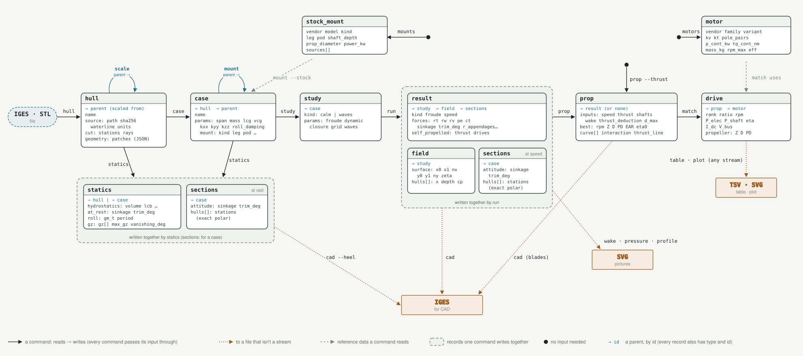

# The boatmath CLI

A set of Unix-style CLI tools for doing physics on boats.

```sh
boatmath hull guillemot.igs --waterline 0.12 > g.jsonl
boatmath case --mass 150 --vcg 0.25 < g.jsonl > g150.jsonl
boatmath statics < g150.jsonl | boatmath table case.params.mass roll.gm_t gz.max_gz
boatmath study --froude 0.2:0.6:0.05 < g150.jsonl | boatmath run > calm.jsonl
boatmath plot -x study.params.froude -y forces.rt -o rt.svg < calm.jsonl
```

## Principles

- **One record, one JSON object; streams are JSONL.** Commands read records
  on stdin (or from files given with `-i`) and write them on stdout, one
  per line. Progress and errors go to stderr. A command that fails on some
  records carries on with the rest and exits 1.
- **Every record carries `type` and `id`.** `id` is the SHA-256 of the
  record's canonical inputs with every default filled in, so asking for the
  same thing twice gives the same id.
- **Records refer to their parents by id.** A case names its hull
  (`"hull": "<id>"`), a study its case, a result its study.
- **A stream carries its own ancestry.** Every record a stream refers to is
  in the stream, before the records that refer to it. A command writes out
  everything it was given, then what it made, so the file at the end of a
  pipeline holds the whole computation: hull, cases, studies, results. Files
  mean something on their own, and can be copied, archived or diffed.
- **Streams merge.** Ids are content hashes, so a record that appears twice
  is the same record, and commands keep the first and drop the rest.
  `cat a.jsonl b.jsonl | boatmath table …` reads two runs as one.
- **No state.** Nothing a command does depends on anything but its input
  and its options. The one exception is opt-in and changes nothing but speed:
  the cache (below).
- **Defining and computing are separate.** `hull`, `scale`, `case` and
  `study` write definitions, which is cheap and lets you edit them with jq.
  `statics`, `run`, `prop` and `match` do the work, each writing records of
  its own that refer back to what they computed from.
- **A hull record holds its geometry.** The solver cuts the hull afresh at
  every attitude, so a hull record holds what it cuts from: the hull's
  B-spline patches (from IGES) or its triangles (from STL), inline as JSON,
  not sections. `hull` reads the file once, applies its import settings
  (waterline, units) and splits it into hulls. After that the input file is
  not needed: `source` records where the geometry came from, for reference
  only.

### Filtering a stream

`head`, `grep` and `jq 'select(…)'` see records, not ancestry: filtering a
stream with them can drop a parent its records still need. `boatmath pick`
filters by record but keeps everything the records it keeps refer to:

```sh
boatmath pick drive --first 5 < drives.jsonl        # the top five drives, their props, results, …
boatmath pick result --where study.params.froude=0.4 < calm.jsonl
boatmath pick --drop field < calm.jsonl             # everything but the bulky fields
```

A command that finds a parent missing says so and names it.

### The cache

`--cache DIR` (or `$BOATMATH_CACHE`) memoizes the expensive steps — a hull's
or case's statics and sections, a study's result and field, a prop's sweep —
by record id and solver version. A step whose record is in the cache is read from it
rather than computed. The output is the same either way; deleting the cache
costs only recomputation. With no cache, nothing is written anywhere but
stdout.

## Records



Each record type below, as a command writes it. Lengths are in metres, speeds
in m/s, forces in N.

### hull

```json
{ "type": "hull", "id": "…", "name": "e12",
  "source": { "path": "/abs/e12.igs", "sha256": "…", "waterline": -0.95, "units": null },
  "cut": { "stations": null, "rays": null, "centerplane": null },
  "parent": null,
  "geometry": { "kind": "nurbs", "hulls": [ { "patches": [ … ] } ] } }
```

`geometry` is in metres, x and y as in the file, z up, with the design
waterline at z = 0. It comes in two kinds:

```json
{ "kind": "nurbs",
  "hulls": [ { "patches": [ { "degree": [3, 3], "n_ctrl": [8, 6],
                              "knots_u": [ … ], "knots_v": [ … ],
                              "ctrl": [ [x, y, z], … ], "trim_uv": null } ] } ] }
{ "kind": "mesh",
  "hulls": [ { "vertices": [ [x, y, z], … ], "triangles": [ [0, 1, 2], … ] } ] }
```

Patches are polynomial (clamped, unweighted) B-splines. `ctrl` is row-major
with v fastest, and `trim_uv` is the `[u0, u1, v0, v1]` box of a bounded
surface. Each entry of `hulls` is one hull, so a file holding two demihulls
gives two. The solver re-poses this geometry exactly as it would the file: a
trim, sinkage or scale maps the control points or vertices. `boatmath::native`
reads and writes it, and it's checked on reading (knot counts, sizes, finite
numbers). For e12, the record is 258 KB against the 1.7 MB IGES, and its cases
and studies come out the same as from the file.

`cut` holds the settings of the cut (stations, rays, a centreplane override).
The id is that of `geometry` plus `cut`. `hull` checks that each hull cuts,
and refuses one that doesn't, but writes no hydrostatics: those are
`statics`'. A scaled hull (`scale`) has the old geometry with its control
points scaled about the design waterline, and `parent` set to the id of the
hull it came from (which `scale` passes through, so it's in the stream).

### case

```json
{ "type": "case", "id": "…", "name": "", "hull": "<hull id>",
  "params": { "span": 1.6, "mass": null, "lcg": null, "vcg": null,
              "kxx": null, "kyy": null, "kzz": null, "roll_damping": 0.0,
              "mount": null },
  "parent": null }
```

A case is a platform on a hull and its load: `span` makes a catamaran;
`mass` defaults to the design displacement, `lcg` to the LCB and `vcg` to
the design waterline; the radii of gyration and roll damping are for
seakeeping. A given mass is carried by sinking: to carry it at the design
waterline instead, scale the hull to it first (`scale --mass`). `mount` is
the propulsion drive on each hull (see [Mounts](#mounts)), and a case
`mount` made has the bare case as its `parent`. A case is only a definition; `statics` computes its float at rest, and `run` whatever
a study on it needs.

### statics

What a hull or a case floats like at rest, from `statics`. On a **hull**, its
hydrostatics at the design waterline, per hull:

```json
{ "type": "statics", "id": "…", "hull": "<hull id>",
  "hulls": [ { "length": 8.63, "beam": 0.84, "draft": 0.22, "displaced_volume": 0.707,
               "wetted_surface": …, "lcb_x": …, "waterplane_area": 5.58, "transom": true } ],
  "notes": [], "solver_version": "…" }
```

On a **case**, its load floated on its platform: the equilibrium at rest,
the hydrostatics there, roll stability and the GZ curve.

```json
{ "type": "statics", "id": "…", "case": "<case id>",
  "mass": …, "lcg": …, "vcg": …,
  "at_rest": { "sinkage": …, "trim_rad": …, "trim_deg": … },
  "hydrostatics": { "volume": …, "displacement": …, "lcb": …, "waterplane_area": …, … },
  "roll": { "gm_t": …, "period": …, "k_xx": …, … },
  "gz": { "heel_deg": [ … ], "gz": [ … ], "gm": …, "max_gz": …, "heel_at_max_deg": …,
          "vanishing_deg": …, "area_30": …, "area_40": …, … },
  "sections": "<sections id>", "seconds": 2.5, "solver_version": "…" }
```

A case's statics are `platform::statics`, minus the display meshes, and
`sections` is its hulls cut at rest, a `sections` record `statics` writes
just before it. Statics that fail are still written, with `error` in place
of the numbers. The id is that of the hull or case, so a statics record is
its hull's or case's statics whatever else is in the stream.

### study

```json
{ "type": "study", "id": "…", "case": "<case id>", "kind": "calm",
  "params": { "froude": 0.35, "dynamic": true, "closure": { "type": "ballistic", "coeff": 1.414 },
              "grid": 640, "waves": null } }
```

`params` is `StudyParams`. A study in waves has
`waves: { "heading": 180, "lambdas": [ … ], "sea": … }` and `kind: "waves"`.

### result

In calm water:

```json
{ "type": "result", "id": "<study id>", "study": "<study id>", "kind": "calm",
  "froude": 0.35, "speed": …, "transverse_wavelength": …, "seconds": 41.0,
  "forces": { "rw": …, "rv": …, "rt": …, "pe": …, "cw": …, "ct": …, "sinkage": …, "trim_deg": …, … },
  "field": "<field id>", "sections": "<sections id>", "solver_version": "…" }
```

In waves:

```json
{ "type": "result", "id": "<study id>", "study": "<study id>", "kind": "waves",
  "froude": …, "speed": …, "attitude": { "sinkage": …, "trim_deg": … },
  "calm": "<the calm-water study it is held about>",
  "peaks": { "heave_peak": …, "heave_peak_lambda": …, "sea_accel_bow": …, … },
  "seakeeping": { "gm_t": …, "headings": [ { "heading": 180, "points": [ … ], "sea": … } ], … },
  "sections": "<its calm-water study's>", "solver_version": "…" }
```

A calm-water result's `sections` is the id of its hulls cut at the attitude
it solved (or held). A result in waves has its calm-water study's, and its
`calm` study and that study's result are in the stream too: `run` computes
them first if they weren't given.

Each of the `seakeeping.headings.0.points` holds `lambda`, `omega`,
`omega_e`, the complex RAOs `heave`, `pitch`, `sway`, `roll` and `yaw` as
`[re, im]`, and the added resistance `raw_gb`.

### field

A calm-water result's bulk: the free surface and the pressure on the hulls.
It's its own record, so the rest of a stream stays small; `run` writes it
just before its result, and `pick --drop field` takes them all out.

```json
{ "type": "field", "id": "…", "result": "<study id>",
  "surface": { "x0": …, "x1": …, "y0": …, "y1": …, "nx": 640, "ny": 301, "zeta": "<base64 f32>" },
  "hulls": [ { "x": [ … ], "depth": [ … ], "half_beam": [ … ], "cp": [ … ], "y": 0.0 } ] }
```

`surface` is the elevation ζ on an `nx × ny` grid over `[x0, x1] × [y0, y1]`,
row-major from `y0`, as base64 little-endian f32. Each hull's pressure
coefficient `cp` and half-breadth are on its stations × depths. There are no
meshes: a picture re-poses the hull's geometry at the attitude instead. For
e12 a field is about 1 MB.

### sections

A case's hulls as the solver cut them at one attitude: written for every
equilibrium, by `statics` (at rest) and by `run` (each calm-water study at
its solved or held attitude).

```json
{ "type": "sections", "id": "…", "case": "<case id>",
  "attitude": { "sinkage": 0.0085, "trim_rad": 0.0015, "trim_deg": 0.087 },
  "hulls": [ { "placement": { "x": 0.0, "y": 0.0 }, "transom": true,
               "stations": [ { "x": 0.18, "z0": 0.0, "beam": 0.186, "depth": 0.0087,
                               "radii": [1.0, 0.9998, …] }, … ] } ] }
```

Each station holds its section exactly as the solver integrates it: rays from
the section's top on the centreplane, at the `n = radii.len()`
Chebyshev–Lobatto angles below the horizontal

```text
θ_k = ¼π (1 − cos(πk / (n − 1))),    k = 0 … n−1,
```

reaching the shell at the scaled distances `radii[k]`. The section is the curve

```text
y(θ) = beam · R(θ) · cos θ,    z(θ) = z0 + depth · R(θ) · sin θ,
```

where `y` is the half-breadth from the hull's centreplane, `z` the depth below
the water, and `R` the polynomial of degree `n − 1` through the radii. It's
best evaluated by barycentric interpolation, as
`michell_geometry::iges::PolarSection::point` does. A station with no radii
lies past the hull's tip. With `transom`, the aft station is a transom. A
catamaran has both demihulls, each with its own placement.

The id is that of the case and the attitude, so a case at rest and every study
held there share one record. Sections only go one way: they can't be re-posed
(that needs the surface above the water), so the hull's `geometry` stays the
source. For e12 at 121 stations of 33 rays, a record is 83 KB.

### prop, drive and motor

See [Propellers and motors](#propellers-and-motors).

## Commands

| command | in → out | does |
|---|---|---|
| `hull FILE… [--waterline LIST --stations --rays --units --centerplane --name]` | files → hull* | cut each file and summarise it |
| `scale [--by LIST] [--beam LIST] [--mass LIST [--keep-length]] [--name]` | hull* → + hull* | hulls scaled about the design waterline |
| `case [--span --mass --lcg --vcg --kxx --kyy --kzz --roll-damping (LISTs)] [--name]` | hull* → + case* | a platform and load on each hull |
| `mount (--stock NAME \| --kind K …)` | case* → + case* | the propulsion drive each case carries: its leg, pod or shaft and strut, and where its propeller sits |
| `mounts` | → stock_mount* | the stock mounts `mount --stock` knows |
| `statics` | hull*/case* → + statics*, sections* | each hull's hydrostatics, each case's float at rest and stability (and, for a case, its sections at rest) |
| `study --froude LIST [--hold] [--closure C] [--grid N] [--waves LIST --lambdas LIST --sea S]` | case* → + study* | requests for every combination |
| `run [-j N] [-q]` | study* → + result*, field*, sections* | compute each study |
| `prop [--d-max L --wake --thrust-deduction --blades LIST --keller-k --top-froude F …]` | result* → + prop* | the best B-series propeller for each result's speed and thrust, on its case's drive |
| `prop --thrust T --speed V --d-max L --depth D [--shafts N] …` | → prop | the same, for a thrust and speed given outright |
| `match [--rank-by power\|mass\|price] [--direct-only] [--max-mass --max-od --max-price --vendor --mapped-only …]` | prop* → + drive* | the motors that can drive each prop, ranked |
| `motors [filters]` | → motor* | the motor database |
| `pick [TYPE] [--first N] [--where PATH=VALUE…] [--drop TYPE…]` | any* → any* | filter a stream, keeping the ancestors of what it keeps |
| `table FIELD… [--explode PATH] [--csv] [--no-header]` | any* → TSV/CSV | a column per field path |
| `plot -x F -y F… [--by F…] [--explode PATH] [--title --xlabel --ylabel] [-o FILE]` | any* → SVG | line plot, a series per y field and `--by` value |
| `wake [-o FILE] [--range M] [--title]` | result* → SVG | the free surface from above |
| `pressure [-o FILE] [--range CP] [--title]` | result* → SVG | the pressure on the hulls from below |
| `profile [-o FILE] [--wave-scale K] [--title]` | result* → SVG | the hull at its attitude, with the wave along its side |
| `cad [-o FILE] [--no-water] [--wave-scale K] [--prop-discs] [--left-handed] [--heel LIST]` | result*/prop*/statics* → IGES | the hulls at their attitude with their drives, the water and a prop's propellers; or a case floated at rest and heeled along its GZ curve; for CAD |

"`+`" marks a command that writes its whole input before what it makes. The
others (`table`, `plot`, the pictures, `cad`) read a stream and write
something that isn't one.

`LIST` is `a,b,c` or `start:stop:step` (or a mixture). Every option given a
list makes one record per combination, so a sweep is one pipeline:

```sh
boatmath case --span 1.6:2.4:0.2 --mass 150,200 < g.jsonl \
  | boatmath study --froude 0.25:0.55:0.05 \
  | boatmath run -j 8 \
  | boatmath plot -x study.params.froude -y forces.rt --by study.case.params.span -o rt.svg
```

`scale` makes new hulls from old, about the design waterline so the
waterline stays where it is: `--by K` scales the whole hull, `--beam K` its
beam and draft only, and `--mass M` whichever of those (uniform, or with
`--keep-length` beam and draft only) makes its design displacement M,
k = (M/M₀)^⅓ or (M/M₀)^½.

`--closure` is `ballistic[:COEFF]`, `fixed:LENGTH` or `off`. `--sea` is
`bretschneider:hs=H,tp=T` or `jonswap:hs=H,tp=T[,gamma=G]`.

`run` needs no statics: a study held at rest (`--hold`) has its case's
attitude at rest found as part of the run. It first computes the calm-water
studies, both those asked for and those the studies in waves are held about,
then the studies in waves. It runs `-j`
studies at once (default: the number of cores) and writes each result, with
its field and sections, as soon as it's ready. A prerequisite calm-water
study it adds is written with its result, so the stream stays whole.

### Field paths

`table` and `plot` name their columns by path:

- `forces.rt`, `seakeeping.headings.0.points`: keys and array indices.
- A parent's id is followed into its record in the stream, so on a result
  `study.case.params.span` reads the span of the result's case. The keys
  followed are `hull`, `case`, `study`, `result`, `parent`, `calm`,
  `sections`, `field` and `prop`, and `motor` into the motor database.
  Links run from child to parent, so a case's statics are reached from the
  statics (`case.params.mass` on a statics record), not from the case. So
  `--explode sections.hulls.0.stations` on a result gives a row per station.
- `|heave|`: the modulus of a complex `[re, im]` pair.
- `id8`: the record's id, shortened to eight characters.

A table or plot has a row per record of the type its first field names a
path on: `table study.params.froude forces.rt` on a stream of hulls, cases,
studies and results has a row per result. `--type T` says so outright.

With `--explode PATH`, each element of the array at `PATH` is a row. Fields
are read from the element first, then from the record:

```sh
boatmath study --froude 0.3 --waves 180 --sea jonswap:hs=0.5,tp=3 < g150.jsonl \
  | boatmath run \
  | boatmath plot --explode seakeeping.headings.0.points -x lambda -y '|heave|' -y '|pitch|'
```

### plot

The SVG uses the reference categorical palette, with light and dark colours
that follow the viewer's colour scheme. It has a legend for two or more
series, a label at the end of each line for up to four, and a tooltip on
every point. It takes at most eight series; narrow `--by` beyond that.

### Mounts

A propeller needs something to hold it, and what holds it matters: a leg,
pod or shaft strut has drag of its own, slows the water the propeller works
in, and feels the propeller's suction. So the drive is part of the case,
like the span, and every step downstream sees it. `mount` writes new cases
carrying one, a drive per hull (both demihulls of a catamaran):

```sh
boatmath mount --stock oceanvolt-sd8 --x 0.9 < cases.jsonl > mounted.jsonl      # a stock mount
boatmath mount --kind saildrive --x 0.9 --shaft-depth 0.45 --chord 0.18 --thickness 0.03 \
  --pod-length 0.4 --pod-diameter 0.1 --nose-ahead 0.15 < cases.jsonl > mounted.jsonl  # or one described
```

The kinds, and where each one's propeller ends up:

| kind | the parts | the propeller |
|---|---|---|
| `saildrive` | a vertical leg, a symmetric foil of chord × thickness, from the hull bottom down to a pod | on the pod's aft end, its axis horizontal |
| `outboard` | the same leg and pod, the leg piercing the water from a bracket on the transom | the same |
| `pod` | a streamlined pod hung close under the hull on a short, deep-chord leg | on the pod's aft end, its axis horizontal |
| `shaft` | a shaft rising forward at `--shaft-angle` from the propeller to where it meets the hull's bottom, a P-strut (a vertical foil of chord × thickness) holding it near the propeller | on the shaft's end, along its line |

The stock mounts are Oceanvolt's saildrives, ePropulsion's outboards and
Fischer Panda's pod drives. A shaft drive has no stock entry: it's
described by its flags.

`--x` places the leg's mid-chord forward of the hull's aft end (an
outboard's is astern of it, on the transom, so `--x` is negative or zero)
and `--y` out from its centreplane. `--shaft-depth` is the shaft below the
hull's keel at the leg (a saildrive or pod), or below the transom's bottom
(an outboard: its clamp height less the transom's draft). The pod's nose is
`--nose-ahead` of the leg's mid-chord and the propeller `--prop-from-nose`
aft of it; `--no-pod` leaves the leg alone (a saildrive's gear housing, the
propeller just aft of the leg), and `--tractor` puts the propeller ahead.
`--prop-diameter` is the drive's own propeller, which `prop` takes for
`--d-max`; `--shaft-angle` tilts the thrust line, bow up. The new cases keep
the old ones' parameters, and their `parent` is the case without the drive
(remounting a mounted case replaces its drive). A drive with a value the
stock table doesn't give (`null`) asks for it, quoting the entry's notes.

A shaft drive's `--x` is its propeller plane, forward of the hull's aft
end, and `--shaft-depth` the shaft's centreline there below the hull's
bottom; the shaft (`--shaft-diameter`) rises forward at `--shaft-angle`
until it meets the bottom (along the keel line: a shaft well off the
centreplane, under a bottom with deadrise, is a little long), and runs a
diameter on into the hull. Its strut stands `--strut-ahead` of the
propeller (default half its chord, 0.1 m and 0.15 of `--prop-diameter`),
from the bottom down to the shaft. A level shaft below the keel never
meets the hull and is refused. `--pair` puts a drive either side of each
hull's centreplane at ±`--y`, twin screws (any kind):

```sh
boatmath mount --kind shaft --pair --x 0.5 --y 0.4 --shaft-depth 0.3 --shaft-angle 8 \
  --shaft-diameter 35mm --chord 0.12 --thickness 0.03 --prop-diameter 0.35 < cases.jsonl
```

The shaft is a member like the others: its waves and near field are the
thin-ship model's (an inclined body of revolution's sections are the
ellipses it cuts at each station), its friction is at a body of
revolution's form factor, and the flow across it adds Hoerner's cross-flow
drag, ½ρV² d L C_D sin³α with C_D = 1.1, at α its angle to the flow (its
own plus the trim). The strut is a foil like a leg. For e12 at Fn 0.3 with
the twin shafts above, R_t is 99.1 N (bare 87.2 N), the shafts and struts
11.8 N of it, and the propellers' thrust line runs at 8.1°, which `prop`
flags as oblique. `--stock NAME` takes a stock mount's
dimensions from a vendored table, each entry sourced from its maker's
installation drawings (`boatmath mounts` lists them); any dimension given as
an option overrides the table's.

What each step does with a mount:

- **`run`.** The parts are thin bodies, and thin-ship theory treats them as
  it does the hull: each leg, strut and pod is a member of the platform with
  its own source sheet, below the hull or (an outboard's leg) piercing the
  water astern of it. So their wave resistance, their interference with the
  hull's waves, and their near field are in the result, as the hull's are,
  and they move with the hull in the attitude solve. A body that doesn't
  reach the surface (a pod, a strut) is cut into sections whose tops lie
  below it. Their viscous drag is each part's own: ITTC-57 friction at its
  own Reynolds number on its wetted area, times a form factor (Hoerner's,
  for a foil and for a body of revolution); there's no junction allowance
  yet. The parts' viscous drag is `forces.r_appendages_viscous`; their
  wave resistance and its interference with the hull's are in `forces.rw`,
  and both are inside `forces.rt`.
- **The attitude is self-propelled.** With a mount, `run` solves for the
  attitude with the thrust, `R_t / cos ε` along the drive's thrust line,
  entering the equilibrium with the hull's own forces. A thrust line below
  the centre of gravity, which every drive's is, trims the bow up; an
  inclined shaft's vertical component `T sin ε` lifts the stern. The
  thrust is the towed resistance, from a first pass without it; the
  result's `self_propelled` keeps it, the drives and the towed attitude.
  For e12 at Fn 0.3 with an Oceanvolt ServoProp 15 2.5 m forward of the
  transom, R_t rises from 87.2 N bare to 97.6 N (9.2 N of it the drive's
  viscous drag), and the thrust trims the bow up 0.011°.
- **`prop`.** The propeller sits where the drive puts it, at its depth and
  on its axis. Its thrust is what the course needs from it along the shaft,
  `T = R_t / ((1 − t) cos ε)`, ε the thrust line's angle to the flow: the
  shaft angle plus the running trim (zero, give or take the trim, for a
  saildrive or outboard). The propeller sees `V_A cos ε` along its axis and
  `V_A sin ε` across it; the B-series takes the axial part, and the cross
  flow, which loads the blades cyclically and brings cavitation on early,
  is flagged above a few degrees (`oblique` in the prop record).
- **Wake and thrust deduction.** Being members of the platform, the
  drive's parts are in both: their potential flow is in the wake at the disc
  (a pod directly ahead of its propeller is most of a saildrive's or pod
  drive's potential wake), and the propeller's suction on their sources is
  in the thrust deduction.
- **`cad`.** The leg as a ruled foil surface, the pod as a body of
  revolution, the shaft as a cylinder and the strut as a foil, on a level of
  their own (4, `MOUNT1`, …), and the propeller where it sits: the one
  `prop` chose, blade by blade (below), or a disc.

### Propellers and motors

`prop` and `match` are a port of propopt's web app (`crates/propeller`, from
its `web/propcore.js` and `web/motorcore.js`; see that crate's docs for the
models). Golden tests hold the port to the original's answers.

```sh
# the hull pipeline's resistance, through to motors
boatmath study --froude 0.4,0.5 < cat.jsonl | boatmath run \
  | boatmath pick result --where study.params.froude=0.4 \
  | boatmath prop --d-max 12in --top-froude 0.5 \
  | boatmath match --rank-by mass --max-mass 25 \
  | boatmath table rank motor motor.vendor P_elec ratio motor.mass_kg

# or a thrust and speed outright, as on the web page
boatmath prop --thrust 1kN --speed 8kn --d-max 16in | boatmath match | boatmath pick drive --first 5
```

**`prop`** takes each calm-water result's speed and the thrust its resistance
asks for along the propeller's axis, T = R_t / ((1 − t) cos ε) (see
[Mounts](#mounts); ε = 0 without one). It splits that across the case's
drives, one per hull, so a catamaran has two. For each rpm it finds the best diameter,
blade-area ratio and blade count, with pitch solved to hold the thrust, under
Keller's and Burrill's cavitation limits. The cheapest point on that curve is
the answer.

- `--wake` and `--thrust-deduction` default to 0. Either can be `auto`
  (below), which needs the result's case to have a mount.
- The shaft depth (for cavitation) is the mount's. A result on a case with
  no mount needs `--depth`, and so does a thrust and speed given outright.
- A second operating point the same propeller must reach comes from
  `--top-froude` (the same study's result at that Froude number, which must
  be in the stream) or from `--top-speed` and `--top-thrust`. It's a
  constraint, not an objective.
- Quantities take units: `16in`, `400mm`, `8kn`, `1kN`, `50kgf`.

```json
{ "type": "prop", "id": "…", "result": "<result id> | null",
  "inputs": { "speed": 4.1, "thrust": 630, "shafts": 2, "wake": 0, "thrust_deduction": 0,
              "d_min": 0.04, "d_max": 0.3048, "blades": [2,3,4,5,6,7], "depth": 0.3,
              "keller_k": 0.2, "cavitation": true, "re_correct": true, "strict_ear": false,
              "top": null },
  "shaft": { "V_A": …, "T": 315, "top_T": null },
  "boat": { "R_T": …, "P_E": …, "eta_H": 1, "QPC": … },
  "feasible": true,
  "best": { "rpm": 1089, "D": 0.305, "PD": 0.87, "EAR": 0.30, "Z": 2, "eta0": 0.778,
            "P_shaft": 1490, "Q": …, "J": …, "K_T": …, "K_Q": …, "Cth": …, "etaIdeal": …,
            "sigma": …, "kellerOk": true, "burrillOk": true, "top": …, "perZ": [ … ], … },
  "best_unconstrained": null,
  "window": { "rpm_lo": …, "rpm_hi": … }, "feasible_rpm": { "lo": …, "hi": … },
  "curve": [ { "rpm": …, "ok": true, "P_shaft": …, "Z": …, "D": …, … }, { "rpm": …, "ok": false } ],
  "interaction": null }
```

**Wake and thrust deduction from potential flow.** With `--wake auto` and/or
`--thrust-deduction auto`, `prop` works them out from the hull's thin-ship
singularities at the result's own attitude and speed (`michell::propulsion`):

- **The disc:** where the case's mount puts it, at its depth and on its
  axis, its hub at least the pod's radius there. It's fixed to the hull,
  so it moves with the hull's sinkage and trim. A disc that breaks the
  surface or cuts a hull is refused.
- **Wake:** the axial perturbation velocity of the hull and its drive's
  parts, averaged over the disc, hub to tip. It's split into the local (potential) wake and the wave wake
  of the hull's own waves. There's no frictional wake.
- **Thrust deduction:** Dickmann's model. The propeller is an actuator-disc
  sink of density 2u_a, with u_a from momentum theory, and Lagally's theorem
  gives the force of its flow on the source sheets of the hull and its drive,
  ΔR = ρ∬σ u_p dA, t = ΔR/T. The sink's field is its Rankine pair (φ = 0
  on the free surface); the waves the propeller itself makes are left out.
- **Iteration:** the propeller is found, its disc placed, w and t computed,
  and the propeller found again until they settle (usually two or three
  steps).
- **Record:** the prop's `interaction` holds w with its parts, t, ΔR, u_a,
  the wake by radius, the discs and the steps.

```sh
boatmath prop --d-max 12in --wake auto --thrust-deduction auto < result.jsonl
```

What thin-ship theory can and can't see: its sources sit on the centreplane,
with strength set by how fast the beam changes along the length. Behind a
fine stern that is the whole story (the Wigley test gives t ≈ 0.03 with a
small propeller close astern). But a flat run ending in a transom carries
almost no sink strength, and the suction on a flat bottom over the propeller
isn't represented at all. That's where most of a transom or planing hull's
thrust deduction comes from. For e12 at Fn 0.3, with a bare disc 0.25 m
astern, it gave w ≈ 0.013 (nearly all wave wake) and t ≈ 0.001: read t
there as the beam-change contribution, a lower bound. A drive's leg and pod
add their own part: with the ServoProp 15 above, w ≈ −0.010 and t ≈ −0.006,
the disc being under the run, where the flow is still speeding up.

The design fields keep propcore.js's names. `curve` is the best propeller at
each of 180 shaft speeds, from the cheapest out to 1.6× its power (or the
whole feasible range with `--full-range`), so `plot --explode curve -x rpm
-y P_shaft --by Z` draws it.

**`match`** walks each motor along a prop's curve. At each point it picks the
reduction that costs least at the battery, and keeps the motor's best point.
Continuous ratings apply at the design point (`--peak` for peak) and peak
ratings at the second point, through the same gearbox. It writes one
`drive` per motor that can do the job, best first. By default that's the best
winding of each family (`--all-windings` for every one), ranked by electrical
power, or by `--rank-by mass` or `price`, where a motor that doesn't publish
the figure goes last. The filters (`--vendor`, `--mapped-only`,
`--single-only`, `--max-mass`, `--max-od`, `--max-price`) are hard limits,
which a motor not publishing the figure fails.

```json
{ "type": "drive", "id": "…", "prop": "<prop id>", "motor": "zapi_gsm309_4a_48v", "rank": 1,
  "rpm": 1055, "P_shaft": 5645,
  "propeller": { "D": 0.406, "PD": 0.81, "EAR": 0.31, "Z": 2, "eta0": 0.729 },
  "P_elec": 6125, "eta": …, "etaWithController": …, "etaDrive": 0.922,
  "ratio": 1, "gearEta": 1, "motorRpm": …, "motorQ": …,
  "V_bus": 20.4, "I_dc": …, "I_arms": …, "load": …, "extrapolated": false,
  "top": null, "tier": "B", "settings": { … } }
```

**Motors** come from propopt's database, vendored unchanged in
`crates/propeller/data/motors.js`: 159 motors from nine makers, each with a
`tier` saying where its efficiency comes from (see that directory's README).
The database is data built into the binary, not state, so drives refer to
motors by their database id rather than carrying motor records in the
stream. `boatmath motors` lists them as records, and a field path follows
`motor` into the database, so `motor.mass_kg` works on a drive.
`match --motors FILE` reads another database, or motor records
(`boatmath motors | jq …`).

### Pictures

`wake`, `pressure` and `profile` draw calm-water results as SVG, in metres
with x forward, to scale. Each needs the result's field, and `profile` its
sections and hull, in the stream. A picture too thin to read at true scale
has its short axis stretched, and the axis label says by how much. With
several results in the stream, `-o` is a pattern naming each picture by
`{id8}` or `{froude}` (`wake-{froude}.svg`).

- `wake`: ζ(x, y) from above, as a heatmap from trough (blue) to crest (red),
  neutral at still water, with the hulls' waterlines drawn over it. The
  colour scale is ±`--range` metres, by default the 99th percentile of |ζ|,
  so a spike at a bow doesn't wash it out.
- `pressure`: C_p on each hull's surface from below (port at the bottom),
  on the pressure solver's grid of stations × depths. The scale is likewise
  ±`--range`.
- `profile`: the first hull side-on at its attitude, its geometry re-posed
  there (topsides and all), with the still waterline and the wave along its
  side: ζ at the waterline half-breadth, and on the centreplane beyond the
  ends. `--wave-scale` exaggerates the wave only, and the picture says so.

### CAD

`cad` writes each calm-water result in a stream as an IGES file to open in
CAD. For a prop on a result, it adds the prop's propellers. For a statics record,
it draws the hull floating at rest and heeled (below).

```sh
boatmath cad -o e12-fn03.igs < result.jsonl
boatmath prop --d-max 12in --wake auto --thrust-deduction auto < result.jsonl \
  | boatmath cad -o e12-prop.igs
```

- **The hulls:** each hull's own B-spline patches, re-posed to the result's
  attitude, so it's exact rather than a mesh. Cut at the still water, the
  exported e12 has the solver's displaced volume at that attitude to 3e-8.
  A hull from an STL has no patches and is refused, for now.
- **The water:** the free surface as one bicubic B-spline through every point
  of the result's wave grid, at full resolution. That's about 640 × 300
  control points, so files run to about 20 MB; `--no-water` leaves it out,
  and `--wave-scale` exaggerates it.
- **The drives:** each hull's mount, its leg, pod, shaft and strut, at the
  hull's attitude.
- **The propellers:** the B-series screw `prop` chose for each drive (its
  blade count, diameter, P/D and EAR), where the case's mount puts it, on
  the shaft's line at the result's attitude. Each blade is a surface
  through its expanded sections wrapped on their pitch helices: the
  series' outline (chord, and the leading edge's place, by radius), its
  thickness `t/D = A − B Z` and where it falls, its 15° rake aft, and the
  four-bladed series' reduced root pitch (Kuiper 1992). The sections are
  segmental, a flat face and a parabolic back, not the series' tabulated
  ordinates: it's a drawing of the propeller, true in outline, pitch and
  thickness, not a definition to cut one to. The hub covers the roots
  (and the pod it sits on, if larger). They turn clockwise seen from
  astern; `--left-handed` for the other hand. `--prop-discs` draws a flat
  annulus, hub to tip, instead.
- **Levels:** hulls on level 1 (white, `HULL1`, `HULL2`), the water on 2
  (cyan, `WATER`), propellers on 3 (red, `PROP1`, …), drives on 4 (yellow,
  `MOUNT1`, …), so each can be toggled as a layer.

The frame is the water's: x forward, y to port, z up, the still water at
z = 0, in metres (the file says so). OpenCASCADE reads the files with every
face valid.

**Statics.** A case's statics give its float at rest and its GZ curve, and
`cad` draws the hull at the poses that matter for stability, each on a level
of its own so they can be shown one at a time:

| level | label | pose |
|---|---|---|
| 1 | `REST` | upright, at its sinkage and trim at rest |
| 11 | `GZMAX` | heeled to the angle of maximum GZ (`gz.heel_at_max_deg`) |
| 12 | `VANISH` | heeled to the angle of vanishing stability (`gz.vanishing_deg`), if the curve has one |
| 13, 14, … | `HEEL30`, … | each heel of `--heel LIST` [deg] |

At each heel the hull floats freely, its sinkage and trim found afresh for
that exact angle, reached as the GZ curve's points are (heeling over from
upright, each float starting from the last), rather than read off the
curve's samples. A pose is the hull's patches rotated rigidly (heel about x,
trim, then sinkage), so it stays exact. Each pose carries, on its level:

- the hull;
- its centre of gravity `G` and centre of buoyancy `B`, as points;
- the righting arm, as a line from `G` across to the vertical through `B`,
  of length GZ.

They're labelled by the pose: `GZMAX` for the hull's patches, `GZMAX-G`,
`GZMAX-B` and `GZMAX-A` (the arm). The angle of vanishing stability is drawn
only when it's a pose of its own (not 0°, a platform with no positive
stability, nor 180°, one that never loses it). A pose that can't be floated
is left out with a warning.

Level 2 is the still water, a flat surface over the hull's extent, shared by
all the poses. A hull's statics, with no load, draw the hull upright at its
design waterline.

```sh
boatmath statics < g150.jsonl | boatmath cad --heel 15,45 -o g150-gz.igs
```

## Code

- **`crates/boatmath`** holds what the CLI and the web app share: `params.rs`
  (`CaseParams`, `StudyParams`), `LoftRequest`, `platform.rs` (statics, wave
  GZ, waves), the calm-water flow and `SOLVER_VERSION`. `boatmath-web`
  re-exports it and keeps the SQLite store, the worker and the pages, so both
  front ends compute the same way.
- `crates/boatmath/src/sections.rs`: a case cut at an attitude, as JSON.
- `crates/boatmath/src/native.rs`: geometry as JSON, read from a file or
  re-posed. `boatmath`'s computations take its bytes wherever they take a
  hull file's, so the web app could store it too.
- **`crates/propeller`**: the B-series propeller search and the motor
  models, ported from propopt's web cores, with its motor database vendored.
- **`crates/boatmath-cli`** (binary `boatmath`): `stream.rs` (reading,
  merging and resolving a stream), `cache.rs`, `records.rs` (hull, scale,
  case, study, statics, sections), `run.rs`, `pick.rs`, `path.rs`, `plot.rs`, `views.rs`
  (wake, pressure, profile), `props.rs` (prop, drive, motor), `cad.rs`,
  `units.rs`, `list.rs`.
- Platforms are single hulls and catamarans (`span`), as in the web app.

## Not yet

- `gz-waves`: quasi-static GZ in a regular wave (`platform::wave_gz`).
- `show`: open a hull, case or result in the 3-D viewer.
- STEP output, real propeller blades (propopt's `propgeom.py`), and CAD
  surfaces for STL hulls.
- Pictures of results in waves (RAOs are a `plot --explode` away already).
- propopt's Python-only work: the BEM correction for an extended or scanned
  geometry (`--geometry`), and its own hull models (the hull pipeline
  replaces those).
- Mounts: `shaft` after the other three; a correction to the propeller's
  thrust and torque in oblique flow (Gutsche), beyond the flag; the
  stock-mount table itself (Oceanvolt, ePropulsion and Fischer Panda, each
  entry from the maker's installation drawings).
- The rest of the wake and thrust deduction: the frictional wake (a
  boundary-layer estimate), the propeller's own waves in the thrust
  deduction, and a bottom-pressure term for flat runs and transoms.
- Warm starts: the web worker starts each equilibrium from the nearest
  speed already solved. `run` starts every one from scratch.
- A study in waves is held about the calm-water study at the default grid.
  A calm study at another grid shares its attitude but is not looked for.
